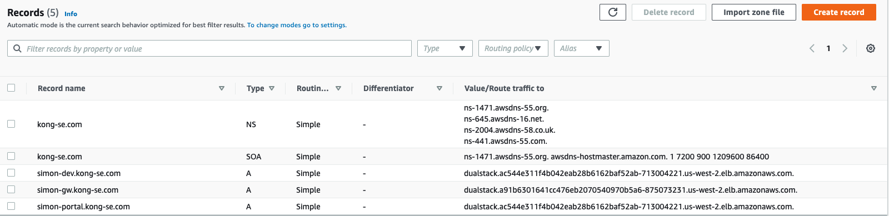

Installing Kong Gateway on Amazon EKS with Terraform
===========================================================

This example stands up a simple Amazon EKS cluster (v1.19), then provides a procedure to install postgres and Kong Gateway Enterprise.  It also makes use of Kong Ingress Controller to proxy requests in through a single AWS loadbalancer, which is best practice.  Lastly, it enables BasicAuth RBAC for Kong Manager and Developer Portal.

## Prerequisites
1. AWS Credentials (Access Key ID and Secret Access Key)
2. AWS Key Pair for SSH
3. Terraform CLI
4. Route53 registered domain name

## Procedure

1. Open `/tf-provision-eks/vpc.tf` to search & replace `simongreen` with your own name.  That way, all EKS objects will be tagged with your name making them easily searchable. Also, update the AWS region in this file to the region of your choice.
2. Via the CLI, login to AWS using `aws configure`.
3. Via the CLI, `cd tf-provision-eks` then run the following Terraform commands to standup Amazon EKS:

```bash
terraform init
terraform apply
```

4. Once terraform has stoodup EKS, setup `kubectl` to point to your new EKS instance:

```bash
aws eks --region $(terraform output -raw region) update-kubeconfig --name $(terraform output -raw cluster_name)
kubectl get all
```

5. Copy your enterprise license file to a new file called `license`.

6. Run the installs script via a BASH shell:

```bash
./install.sh
```

7. Via the AWS web console, update your Route53. In my example, I use `*.kong-se.com` as the Record Name, Record type=A, and for Value I use "Alias to Netowrk Load Balancer" and set it to the hostname output from step 6.

8. Verify the Kong ingress rule in K9s or similar.  The `Address` field should be populated like so:



9. Login to Kong Manager with:

* http://simon-dev.kong-se.com (u: kong_admin p: KongRul3z!)

10. Kong Dev Portal can be reached at `http://simon-portal.kong-se.com` once Dev Portal has been enabled via the Manager.

## Deck commands

Once you know the Kong Admin API URL, you can execute the following deck commands:

```bash
# add route + service
deck sync -s add-route-service.yaml --kong-addr http://<admin API host>:8001
# add graphql rate limiting
deck sync -s add-rl-plugin.yaml --kong-addr http://<admin API host>:8001
# reset Kong to it's initial state
deck reset --kong-addr http://<admin API host>:8001
```